## Дипломная работа по профессии «Системный администратор»
## Горбунов Владимир

### Задание 

```
Ключевая задача — разработать отказоустойчивую инфраструктуру для сайта, включающую мониторинг, сбор логов и резервное копирование основных данных. Инфраструктура должна размещаться в [Yandex Cloud](https://cloud.yandex.com/) и отвечать минимальным стандартам безопасности
```
Подробнее... 

## Содержание

- [Общий план инфраструктуры](#Общий-план-инфраструктуры)
- [Технические детали развертывания и обеспечения](#Технические-детали)
- [Структура проекта](#Структура-проекта)
- [Безопасность и сети](#Безопасность-и-сети)
- [Nginx и сертификаты](#Nginx)
- [Кластер Postgres](#Кластер-Postgres)
- [Мониторинг с помощью Zabbix](#Zabbix-мониторинг)
- [Сбор логов. ELK](#ELK)
- [Бэкапы, снапшоты](#Бэкапы)

## Общий план инфраструктуры
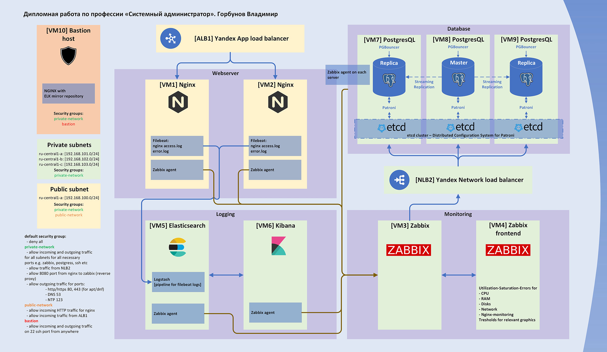


## Технические детали

- Развертывание инфраструктуры автоматизировано с помощью Terraform, Ansible и Gitlab.
- Все этапы выполняются в одном пайплайне
- Self-hosted Gitlab работает на локальном домашнем сервере. Раннер запускается в докер-контейнере.  Чуть подробнее задокументировал [по ссылке](https://github.com/Night-N/Gitlab_practice/tree/master/home_server)  
  Для запуска Терраформа используется оффициальный образ от гитлаба `gitlab-org/terraform-images/stable:latest`  
  Для запуска Ansible образ собирается в начале пайплайна на основе alpine:3.18 ([Dockerfile](./Dockerfile)) и загружается в Container registry гитлаба  
- Этапы работы
  - сборка образа для ансибла 
  - terraform validate
  - terraform plan
  - terraform apply
  - провижн машин с помощью ансибл
    - плейбук с постгресом
    - плейбук со всеми остальными сервисами
  - terraform destroy (запускается вручную)  
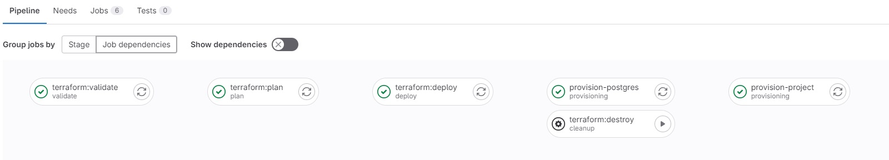
- Все чувствительные данные передаются в джобы через переменные окружения CI/CD - токен яндекса, имя пользователя, приватный и публичный ключи SSH для доступа к создаваемым машинам. IP адреса создаваемых машин передаются в ансибл через terraform output -> dotenv артефакты  

<div align="center">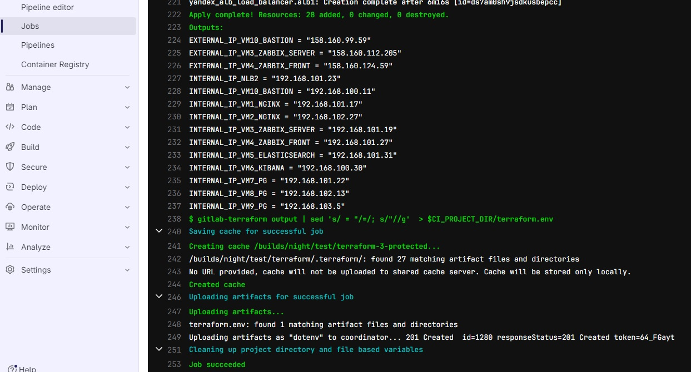  
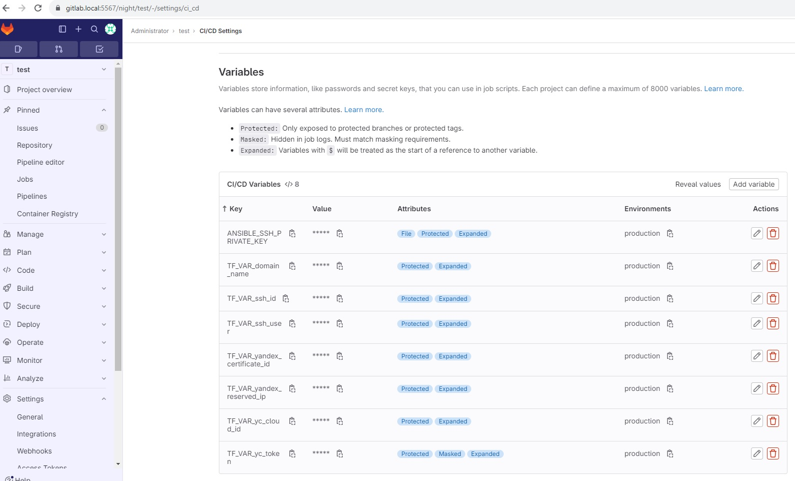 </div>

- Для реализации проекта из имеющихся у Яндекса вариантов выбрал дистрибутив AlmaLinux 8, т.к. с убунтой и дебианом работал c начала учебы, и решил, что пора изучать дистрибутивы RHEL, для CentOS больше нет поддержки, а из опенсорс вариантов активно развивается AlmaLinux.  

<div align="center">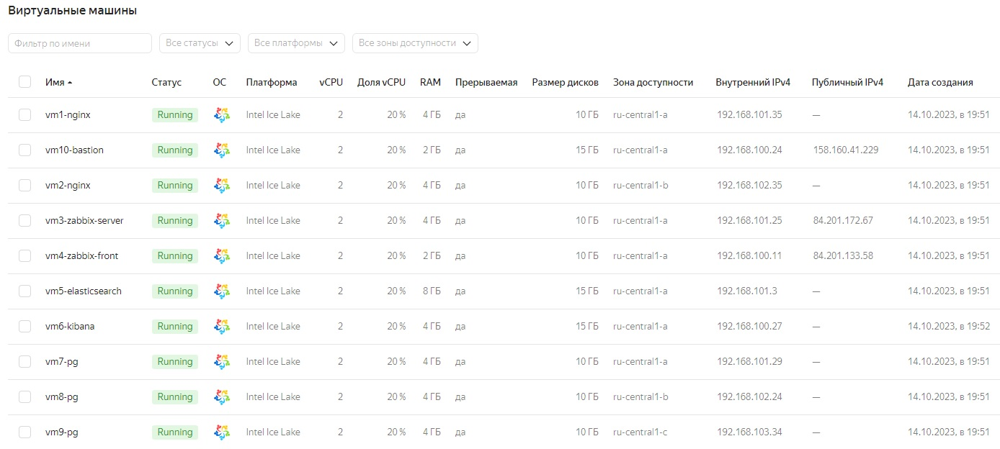</div>

## Структура проекта

- Пайплайн: [.gitlab-ci.yml]()
- Инфраструктура в Терраформе: [./terraform/](./terraform/)
- Провижн необходимых сервисов с помощью Ансибл:
  - Postgres cluster:  [./ansible/postgres/](./ansible/postgres/) `(адаптирован плейбук https://github.com/vitabaks/postgresql_cluster)`
    - [./ansible/postgres/inventory](./ansible/postgres/inventory)
    - [./ansible/postgres/deploy_pgcluster.yml](./ansible/postgres/deploy_pgcluster.yml)
  - ELK, Zabbix, nginx: [./ansible/project/](./ansible/project/)
    - [./ansible/project/inventory](./ansible/project/inventory)
    - [./ansible/project/deploy_project.yml](./ansible/project/deploy_project.yml)

### Безопасность и сети

- На этапе разворачивания инфраструктуры создаются четыре подсети в одной VPC - условно разделенные на 3 приватных и 1 общедоступную. Открытые порты определяются с помощью групп безопасности и назначаются на сетевые интерфейсы. Дефолтная группа безопасности для всей VPC запрещает любой трафик. 
  - 3 приватных сети расположены в трех разных доступных в яндексе зонах - a, b и с. Это сделано для того, чтобы машины с Patroni-Postgres и NGINX физически располагались в разных ДЦ. 
  - 1 общедоступная - в зоне а  

<div align="center">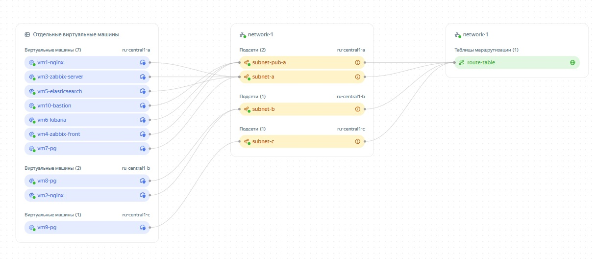</div>

- Создано три группы безопасности 
  - в группе private-network разрешен трафик для необходимых портов (постгрес, patroni, etcd, ELK, zabbix, ssh) для всех четырех подсетей, также разрешен **исходящий** трафик для скачивания обновлений и пакетов и обращения к серверам DNS и NTP  
[./terraform/sec_private.tf](./terraform/sec_private.tf)  
  - группа public-network - это сервисы, которые должны быть доступны извне - внешний балансировщик Яндекса и NGINX. При этом GUI Kibana и Zabbix сидят за обратным прокси nginx.  
[./terraform/sec_public.tf](./terraform/sec_public.tf)
  - группа bastion-network - доступ SSH извне. Единственная ВМ с этой группой - bastion host.   
[./terraform/sec_bastion.tf](./terraform/sec_bastion.tf)  
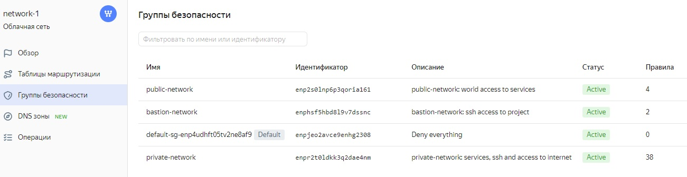  
- Т.к. реализована концепция Bastion host, дальнейшая установка сервисов на машинах выполняется Ansible подключением jump host  
```
ansible_ssh_common_args="-o StrictHostKeyChecking=no -o UserKnownHostsFile=/dev/null -o ProxyCommand=\"ssh -o StrictHostKeyChecking=no -q \"{{ lookup('ansible.builtin.env', 'TF_VAR_ssh_user') }}\"@\"{{ lookup('ansible.builtin.env', 'EXTERNAL_IP_VM10_BASTION') }}\" -o IdentityFile=\"{{ lookup('ansible.builtin.env', 'ANSIBLE_SSH_PRIVATE_KEY') }}\" -o Port=22 -W %h:22\""
```

## Nginx

- Роль: [./ansible/project/roles/nginx/](./ansible/project/roles/nginx/)
- В яндексе на время работы с проектом зарезервирован один статический IP адрес, для которого у стороннего провайдера добавлена CNAME запись, а в Certificate Manager Яндекса выпущен let's encrypt сертификат для домена - это сделано заранее вручную. 

<div align="center">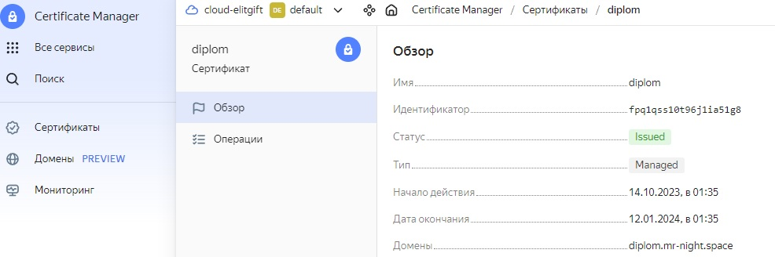</div>

- SSL сертификат терминируется на балансировщике ALB1 Яндекса, балансировщик привязывается к зарезервированому IP адресу, далее трафик передается на http роутер и на бэкэнд, к которому привязана таргет-группа nginx-хостов. 
- Добавлен обратный прокси, который перенаправляет на GUI забикса (https://diplom.mr-night.space/zabbix) и кибаны (https://diplom.mr-night.space/kibana) 

<div align="center"></div>
<div align="center">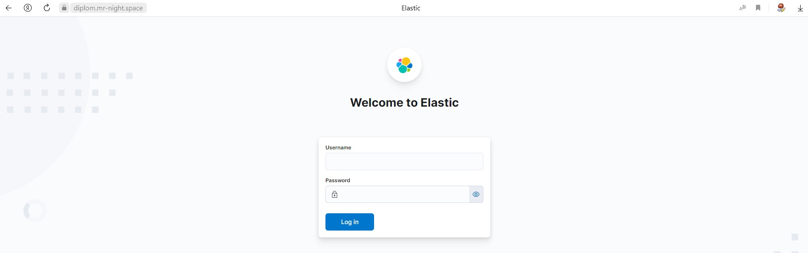</div>
<div align="center"></div> 


## Кластер Postgres

- Для разворачивания Postgres адаптирован плэйбук по ссылке: https://github.com/vitabaks/postgresql_cluster
- Плэйбук: [./ansible/postgres/deploy_pgcluster.yml](./ansible/postgres/deploy_pgcluster.yml)
- Кластер постгреса состоит из трех машин, разнесенных по трем разным локациям яндекса - ru-central1-a, ru-central1-b, ru-central1-c
- Устанавливаются и конфигурируются Postgres, Patroni, etcd, pgbouncer.  
- Кластер состоит из мастера и двух реплик, управляемых Patroni, работает в режиме Hight Availability, внутренний балансировщик Яндекса определяет мастера, подключения клиентов идут через PGBouncer, режим пула - transaction.
- RestAPI Patroni на порту 8008 используется для определения мастера по запросу к адресу [хост]:8008/master.  
Балансировщик яндекса блокирует опрашиваемые и таргетные порты, поэтому дополнительно устанавливаются правила IPtables для взаимодействия с балансировщиком и отдачи ему информации на недефолтных портах, в итоге после выполнения этого плейбука внутренний балансировщик выглядит так:  

<div align="center"></div>

- Подключение с бастиона на адрес балансировщика:  

<div align="center"></div>

- Базу данных в проекте использует Zabbix, поэтому сразу в плейбуке создается пользователь и пустая бд по дефолтному шаблону постгреса.

<div align="center"></div>

- в pg_hba добавлены scram-sha-256 подключения из приватных сетей проекта

<div align="center"></div>

- Порты, необходимые для работы этой части инфраструктуры: 
  - 8008 (Patroni)
  - 8007 (Patroni для балансировщика)
  - 2379,2378 (etcd)
  - 5432 postgres
  - 5431 (postgres для балансировщика)
  - 6432 (pgbouncer)
  - 10050 (zabbix agent)
- Кластер доступен:

<div align="center"></div>

- Пробное отключение мастера:

<div align="center"></div>

- Состояние кластера, лидер мгновенно поменялся:

<div align="center"></div>

- Вновь подключаемся с бастиона на адрес балансировщика, создаём новую таблицу:

<div align="center"></div>

- Обратное включение, бывший мастер становится репликой и догоняет нового мастера:

<div align="center"></div>


## Zabbix мониторинг
- Роли: 
  - [./ansible/project/roles/zabbix_server/](./ansible/project/roles/zabbix_server/)
  - [./ansible/project/roles/zabbix_front/](./ansible/project/roles/zabbix_front/)
  - [./ansible/project/roles/zabbix_agent/](./ansible/project/roles/zabbix_agent/)
- Подключен мониторинг хостов заббиксом
- Дополнительно на nginx хостах включен модуль stub_status для мониторинга соединений
- На заббикс сервере после включения авторегистрации агентов сразу начинают поступать данные с хостов:

<div align="center">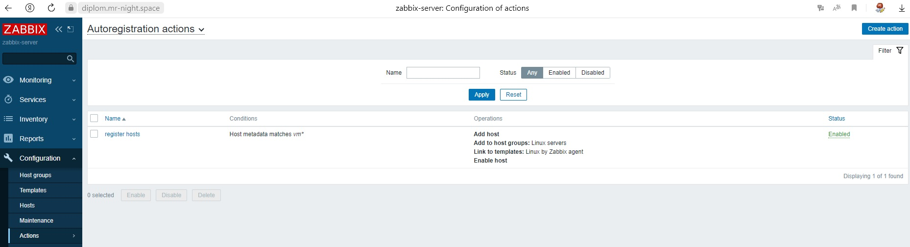</div>
<div align="center">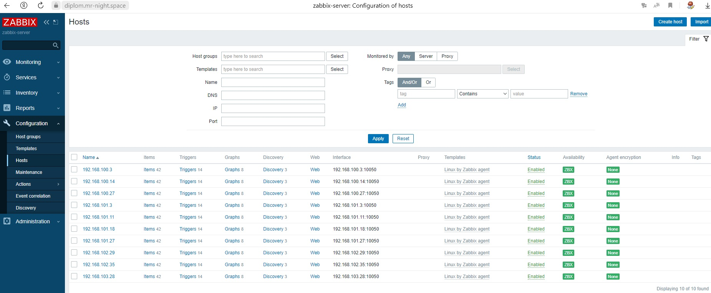</div>
<div align="center">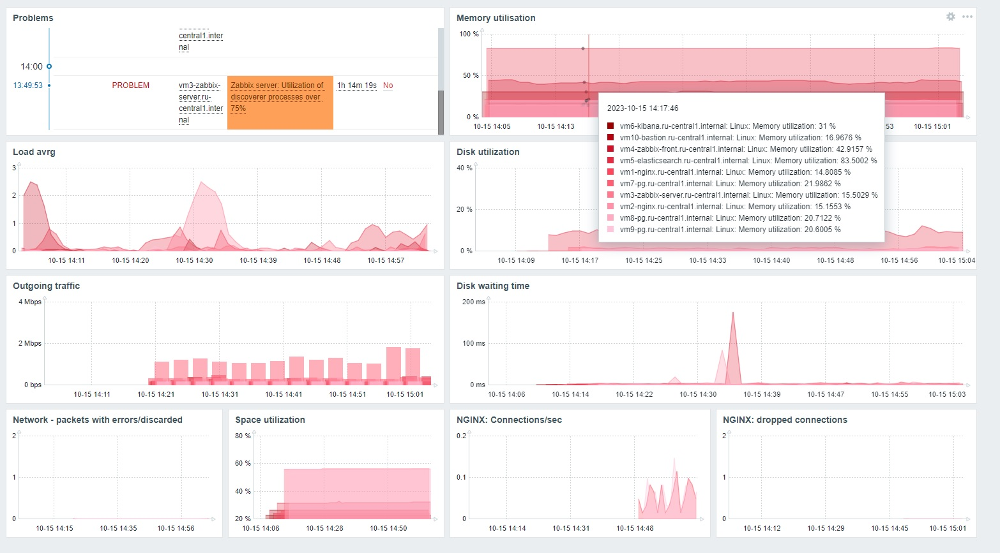</div>

- Мониторинг CPU, Memory, Network, NGINX.

<div align="center"></div>


## ELK

- По состоянию на 9 окт. 2023 ресурсы elasticsearch недоступны из России с официального репозитория, зеркало яндекса отключено, также недоступен docker registry эластика, в котором хранятся образы логсташа, метрикбита и файлбита. 
- В связи с этим необходимые пакеты скачаны через VPN, создан локальный yum репозиторий, в хранилище образов добавлен образ готового диска с ОС и nginx. 
Для репозитория решил использовать Bastion host (для оптимизации ресурсов). Он сразу создается из заранее подготовленного образа с включенным nginx'ом.   
- С помощью плейбука производится 
  - Установка Elasticsearch
  - Генерация enrollment-token для Kibana и её подключение к эластику
  - Установка Metricbeat на все хосты (на всех хостах включается модуль System, на хосте с эластиком - модуль для Elasticsearch и Kibana). 
  - Установка Logstash на хост c Elasticsearch
  - Установка Filebeat на nginx хосты
- Т.к. у меня тестовый проект, Logstash отправляет логи в кластер под пользователем elastic, но для использования в продакшене необходимо создать отдельного пользователя с необходимыми ролями, то же касается Metricbeat. Так же из доработок на которые сейчас решил не тратить время - включение API Logstash и его мониторинг.
- Filebeat поставляет логи в логсташ, где настроен один пайплайн, который разбирает логи на разные индексы по document_type, устанавливаемому файлбитом. 
Конвейер Logstash:
```
input {
  beats {
      port => "5044"
      host => "192.168.101.31"
  }
}

filter {
  if [fields][document_type] == "nginx-access" {
    grok {
      match => {
        "message" => "%{IPORHOST:ip} - %{DATA:user_name} \[%{HTTPDATE:time}\] \"%{WORD:http_method} %{DATA:url} HTTP/%{NUMBER:http_version}\" %{NUMBER:response_code} %{NUMBER:body_sent_bytes} \"%{DATA:request_referer}\" \"%{DATA:user_agent}\""
      }
    }
  }
  else if [fields][document_type] == "nginx-error" {
    grok {
      match => {
        "message" => "%{TIMESTAMP_ISO8601:timestamp} \[%{LOGLEVEL:loglevel}\] \[%{DATA:error_type}\] %{GREEDYDATA:error_message}"
      }
    }
  }
}

output {
  if [fields][document_type] == "nginx-access"  { 
    elasticsearch {
      index => "nginx-access-%{+YYYY.MM.dd}"
      hosts => ["https://192.168.101.31:9200"]
      user => "elastic"
      password => "IzjkJbO68HHDFc_c2Jf9" 
      cacert => "/etc/elkcert/http_ca.crt" 
    }
  }
  else if [fields][document_type] == "nginx-error"  {
    elasticsearch {
      index => "nginx-error-%{+YYYY.MM.dd}"
      hosts => ["https://192.168.101.31:9200"]
      user => "elastic"
      password => "IzjkJbO68HHDFc_c2Jf9" 
      cacert => "/etc/elkcert/http_ca.crt" 
    }
  }
}
```
состояние кластера
`curl -k -X GET -u elastic:password 'https://localhost:9200/_cluster/health?pretty'`
<div align="center">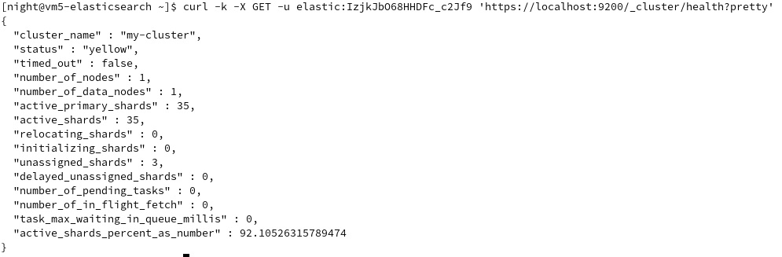</div>

Состояние индексов
`curl -k -X GET -u elastic:password  'https://localhost:9200/_cat/indices'`
<div align="center">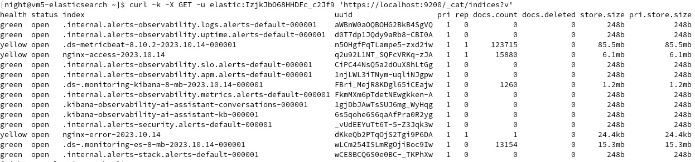</div>

(Yellow, потому что в кластере эластика только одна мастер-нода)

- Мониторинг самого себя с помощью метрикбит:  

<div align="center">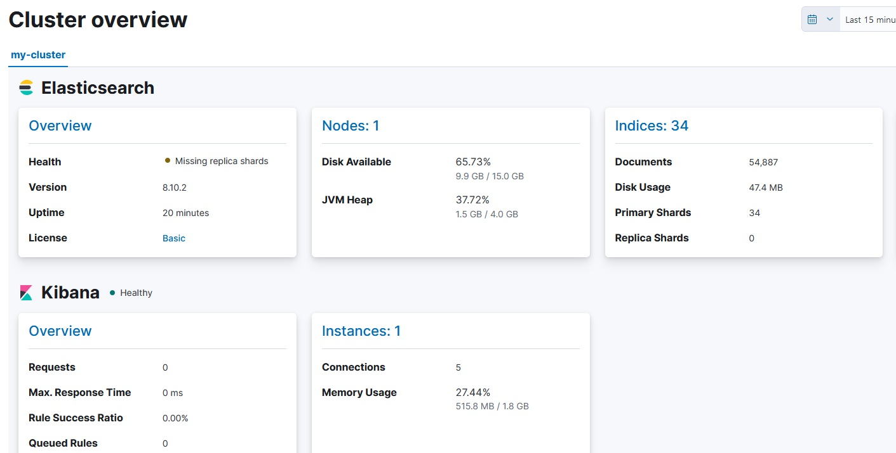</div>

- Доступные индексы  

<div align="center">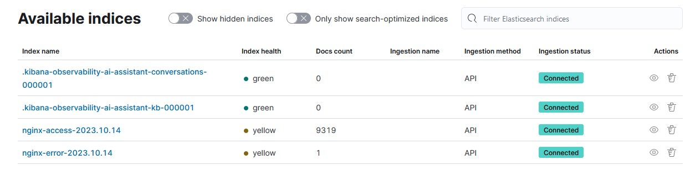</div>

- Хосты (установлен модуль system метрикбита):  

<div align="center">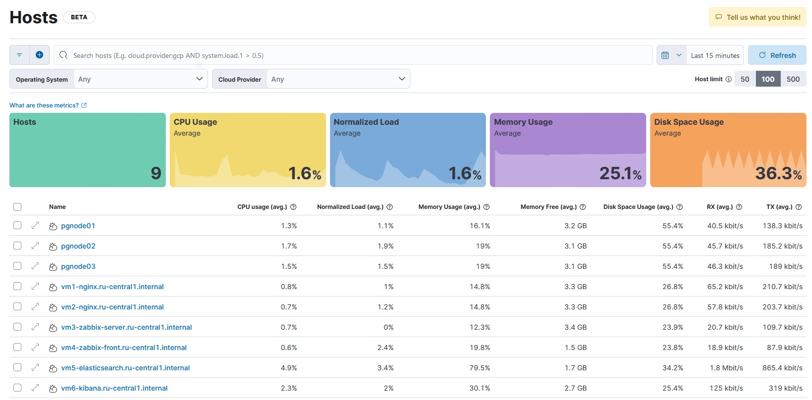</div>
<div align="center">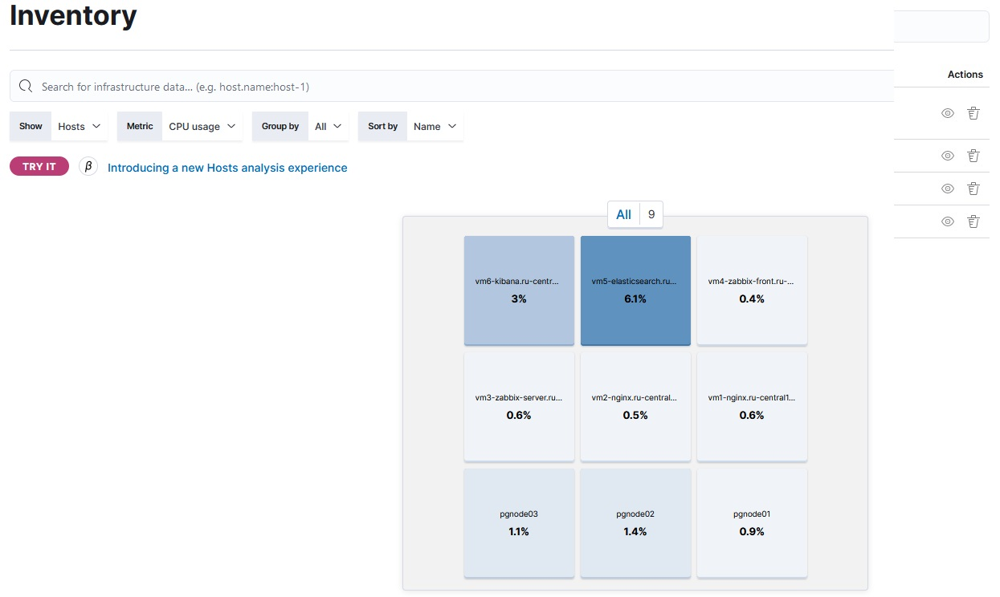</div>

- Nginx логи, стастика доступа к страницам:  

<div align="center">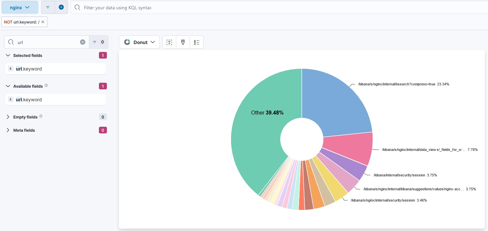</div>

## Бэкапы

- Также настроены ежедневные снапшоты дисков со сроком жизни не более недели:
[./terraform/snapshot.tf](./terraform/snapshot.tf)